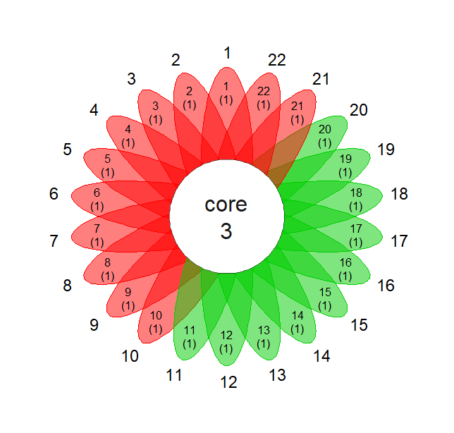
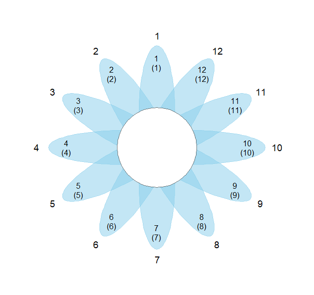
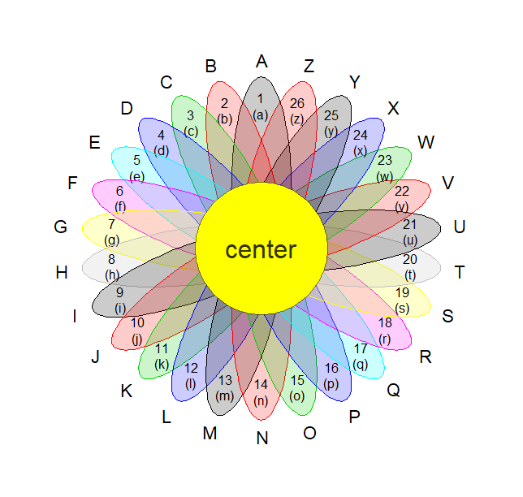

## 花瓣图绘制

fork from https://github.com/DongliangXu/flower

增加了一些参数 **circle_**，中间圆心的样式

## 示例图片




```
flower_plot(sample = 1:12, value = 1:12,subvalue = 1:12)
```


```
flower_plot(sample = LETTERS, value=1:26,subvalue = letters,
            ellipse_col = 1:12,
            text_cex = 1.4,alpha = .2,
            circle_col = 'yellow',
            circle_text = 'center',
            circle_text_cex = 2)
```



